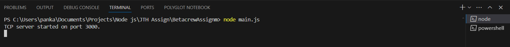
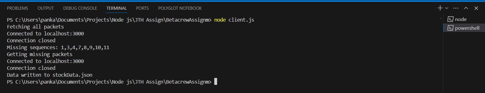

# BetacrewAssignm
Betacrew assignment to read stock data from mock server

## Instructions to run
Clone the repository:\
`git clone https://github.com/pnaruka/BetacrewAssignm`\

Navigate to the project directory:\
`cd BetacrewAssignm`

Open a terminal and run this command to start the server:\
`node main.js`

Open another terminal and run this command to run the client:\
`node client.js`

A new file named `stockData.json` will be generated in the same directory.

## Screenshots:
`Start Server`:  \
`Start Client`:  \
`Sample Output`:  \